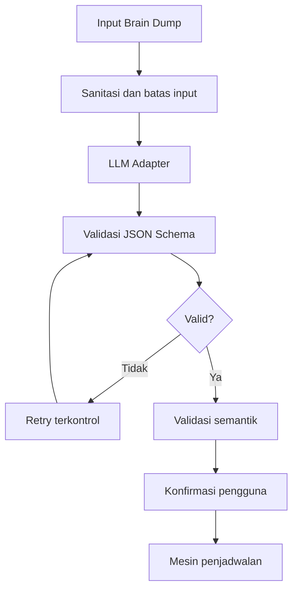
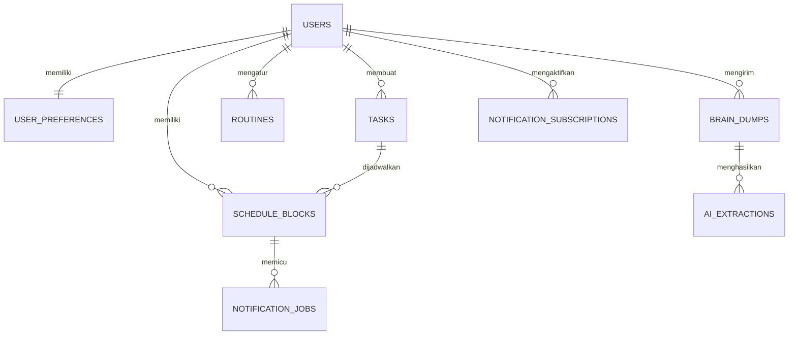
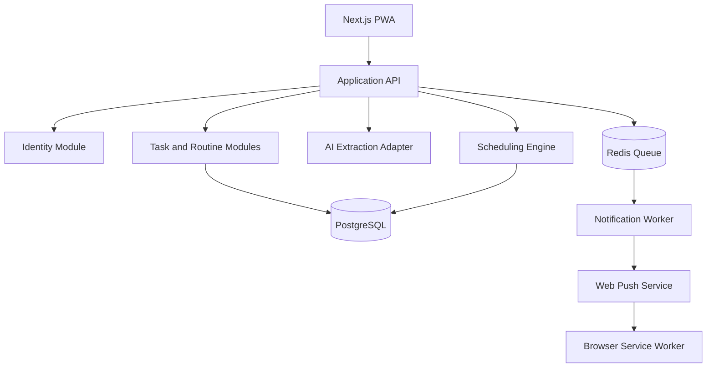

# Product Requirements Document (PRD)

## Assistant Reminder — Auto-Scheduler

| Informasi | Nilai |
|---|---|
| Versi dokumen | 2.0.0 |
| Tanggal | 14 Agustus 2026 |
| Status | Baseline untuk implementasi |
| Target rilis | V1 / Minimum Lovable Product |
| Platform | Progressive Web App (desktop dan mobile) |
| Bahasa awal | Bahasa Indonesia |
| Database utama | PostgreSQL |
| Arsitektur | Modular monolith dengan background worker |

---

## 1. Ringkasan Produk

Assistant Reminder adalah aplikasi perencanaan waktu personal yang mengubah daftar kegiatan tidak terstruktur menjadi jadwal mingguan yang realistis, bebas benturan, mudah disesuaikan, dan memiliki pengingat.

Pengguna dapat menuliskan rencana dengan bahasa sehari-hari melalui fitur **Brain Dump**. AI mengekstrak tugas, durasi, tenggat, prioritas, serta preferensi waktu. Pengguna memeriksa hasil ekstraksi sebelum mesin penjadwalan menyusun jadwal berdasarkan rutinitas tetap, kapasitas harian, waktu istirahat, deadline, dan aturan lain yang telah ditetapkan.

AI tidak menjadi satu-satunya penentu jadwal. AI memahami maksud pengguna, sedangkan mesin aturan memastikan hasil jadwal valid dan dapat dijelaskan.

### 1.1 Pernyataan produk

> Membantu pengguna beralih dari “apa saja yang harus saya kerjakan” menjadi “kapan saya dapat mengerjakannya secara realistis”.

### 1.2 Nilai utama

- Mengurangi waktu yang dibutuhkan untuk menyusun jadwal mingguan.
- Mencegah jadwal bertabrakan dengan rutinitas tetap.
- Membantu pengguna melihat apakah beban tugas sesuai dengan waktu yang tersedia.
- Mempermudah penyesuaian jadwal ketika rencana berubah.
- Tetap dapat digunakan melalui pembuatan tugas dan penjadwalan manual ketika layanan AI tidak tersedia.

---

## 2. Masalah yang Diselesaikan

Pengguna sering memiliki banyak target, tetapi informasi tersebut masih berupa catatan, percakapan, atau ingatan. Kesulitan muncul ketika pengguna harus menentukan durasi, prioritas, waktu pengerjaan, dan menyesuaikannya dengan rutinitas yang sudah ada.

Masalah utama yang ditangani:

1. Daftar tugas belum memiliki waktu pengerjaan yang jelas.
2. Jadwal dibuat terlalu padat dan tidak menyediakan jeda.
3. Tugas bertabrakan dengan kuliah, kerja, tidur, makan, atau rutinitas lain.
4. Pengguna kesulitan menyusun ulang jadwal setelah terjadi perubahan.
5. Pengguna lupa memulai aktivitas karena tidak mendapat pengingat.
6. Aplikasi pencatat tugas biasanya menyimpan “apa”, tetapi belum membantu memutuskan “kapan”.

---

## 3. Tujuan dan Ukuran Keberhasilan

### 3.1 Tujuan V1

- Mengubah input bahasa alami menjadi daftar tugas terstruktur.
- Menghasilkan jadwal yang tidak bertabrakan dengan blok waktu tetap.
- Memungkinkan pengguna meninjau, mengubah, dan mengonfirmasi hasil AI.
- Menyediakan tampilan jadwal yang nyaman pada desktop dan mobile.
- Menyediakan penjadwalan ulang yang aman dan dapat dibatalkan.
- Mengirim pengingat berbasis Web Push dengan mekanisme best effort.
- Menjaga keamanan dan pemisahan data setiap pengguna.

### 3.2 Indikator produk

Indikator berikut dipakai setelah aplikasi memiliki pengguna uji:

| Indikator | Target awal V1 |
|---|---:|
| Pengguna menyelesaikan onboarding | ≥ 70% |
| Brain dump berhasil menjadi tugas terstruktur | ≥ 90% permintaan valid |
| Hasil ekstraksi diterima tanpa perubahan besar | ≥ 70% |
| Jadwal tersimpan tanpa benturan | 100% |
| Pengguna berhasil membuat jadwal pertama | ≥ 65% pengguna baru |
| Permintaan AI yang gagal mendapat fallback yang dapat digunakan | 100% |
| Crash-free sessions | ≥ 99,5% |
| Pengiriman notifikasi yang diterima worker tanpa error permanen | ≥ 98% |

Angka tersebut merupakan target operasional awal, bukan klaim manfaat sebelum pengujian pengguna dilakukan.

### 3.3 Bukan tujuan V1

- Menjamin semua tugas pengguna akan selesai.
- Menggantikan keputusan personal pengguna.
- Mengirim notifikasi tepat pada milidetik tertentu.
- Mendiagnosis kondisi kesehatan atau mengatur beban kerja medis.
- Menjalankan tindakan eksternal tanpa persetujuan pengguna.

---

## 4. Target Pengguna

### 4.1 Pengguna utama

- Mahasiswa dengan jadwal kuliah tetap dan tugas yang berubah setiap minggu.
- Pekerja individual dengan rapat, pekerjaan fokus, dan target mingguan.
- Freelancer yang menangani beberapa pekerjaan dengan deadline berbeda.
- Pengguna umum yang membutuhkan pembagian waktu untuk pekerjaan, rutinitas, dan aktivitas pribadi.

### 4.2 Kebutuhan pengguna

| Kebutuhan | Respons produk |
|---|---|
| Memasukkan banyak rencana dengan cepat | Brain Dump |
| Memastikan AI memahami maksud pengguna | Layar konfirmasi hasil ekstraksi |
| Melindungi jadwal penting | Rutinitas dan blok tetap |
| Mengetahui kapan tugas dikerjakan | Mesin penjadwalan |
| Memperbaiki rencana yang berantakan | Reschedule My Day |
| Memindahkan kegiatan secara manual | Drag-and-drop dan kontrol alternatif |
| Diingatkan sebelum aktivitas | Web Push Notification |
| Tetap bekerja tanpa AI | Pembuatan dan penjadwalan manual |

---

## 5. Ruang Lingkup

### 5.1 Termasuk dalam V1

1. Registrasi, login, logout, dan pemulihan kata sandi.
2. Onboarding preferensi waktu dan rutinitas awal.
3. Pengelolaan profil, zona waktu, dan pengaturan notifikasi.
4. Pembuatan tugas manual.
5. Brain Dump berbasis AI.
6. Konfirmasi dan koreksi hasil ekstraksi AI.
7. Pengelolaan rutinitas dan blok waktu tetap.
8. Mesin penjadwalan mingguan.
9. Tampilan agenda harian dan kalender mingguan.
10. Pemindahan serta perubahan durasi blok jadwal.
11. Pemeriksaan konflik.
12. Reschedule My Day dengan preview, konfirmasi, dan undo.
13. Status tugas dan blok jadwal.
14. Web Push Notification.
15. PWA yang dapat dipasang.
16. Akses offline terbatas untuk melihat jadwal terakhir yang telah tersinkron.
17. Riwayat perubahan penting untuk audit dan undo.
18. Ekspor data pengguna dalam format JSON atau CSV yang relevan.
19. Penghapusan akun dan data personal.

### 5.2 Ditunda setelah V1

- Sinkronisasi Google Calendar, Outlook Calendar, dan kalender eksternal lain.
- Jadwal bersama, tim, delegasi, dan approval.
- Aplikasi Android atau iOS native.
- Pengeditan offline penuh dan resolusi konflik lintas perangkat.
- Analitik produktivitas kompleks.
- Asisten suara.
- Integrasi email, Slack, Teams, atau aplikasi pihak ketiga.
- Integrasi langsung dengan smartwatch.
- Pembayaran dan paket berlangganan.
- AI yang menjalankan tindakan eksternal secara otonom.
- Rekomendasi berbasis kebiasaan jangka panjang.

---

## 6. Prinsip Produk

1. **Pengguna memegang keputusan akhir.** Jadwal AI selalu dapat ditinjau dan diubah.
2. **Tidak ada penyimpanan diam-diam.** Hasil Brain Dump tidak menjadi jadwal aktif sebelum dikonfirmasi.
3. **Aturan keras tidak boleh dilanggar.** Rutinitas tetap, waktu tidur, dan benturan waktu dilindungi.
4. **Kegagalan harus dapat dipulihkan.** Setiap fungsi AI memiliki fallback manual.
5. **Perubahan besar dapat dibatalkan.** Penjadwalan ulang menyimpan versi sebelumnya.
6. **Jadwal harus realistis.** Sistem menyampaikan jika kapasitas waktu tidak cukup.
7. **Privasi menjadi default.** Isi jadwal tidak dimasukkan ke log aplikasi yang tidak diperlukan.
8. **Mobile bukan versi desktop yang diperkecil.** Mobile menggunakan agenda yang lebih sesuai untuk layar sempit.

---

## 7. Istilah Produk

| Istilah | Definisi |
|---|---|
| Tugas | Pekerjaan yang perlu diselesaikan dan dapat belum memiliki waktu pengerjaan |
| Blok jadwal | Penempatan tugas atau aktivitas pada rentang waktu tertentu |
| Rutinitas | Aktivitas berulang yang memiliki pola waktu tertentu |
| Blok tetap | Aktivitas dengan waktu yang tidak boleh dipindahkan mesin penjadwalan |
| Blok fleksibel | Aktivitas yang dapat dipindahkan sesuai aturan |
| Brain Dump | Input teks bebas yang diubah AI menjadi calon tugas |
| Deadline | Batas waktu penyelesaian tugas |
| Earliest start | Waktu paling awal tugas boleh dimulai |
| Preferred window | Waktu yang disukai untuk mengerjakan tugas |
| Hard constraint | Aturan yang tidak boleh dilanggar |
| Soft preference | Preferensi yang diusahakan tetapi dapat dikompromikan |
| Schedule version | Snapshot jadwal sebelum atau sesudah perubahan besar |
| Reschedule | Penyusunan ulang tugas fleksibel yang belum selesai |

---

## 8. Alur Utama Pengguna

### 8.1 Pengguna baru

1. Pengguna membuat akun.
2. Pengguna memverifikasi akun jika verifikasi email diaktifkan.
3. Pengguna menetapkan zona waktu.
4. Pengguna mengisi jam tidur, hari aktif, jam kerja/kuliah, waktu istirahat, dan preferensi fokus.
5. Sistem membuat rutinitas awal.
6. Pengguna diarahkan ke halaman Today dengan panduan singkat membuat jadwal pertama.

### 8.2 Brain Dump menjadi jadwal

1. Pengguna menulis rencana mingguan.
2. Backend membersihkan dan membatasi input.
3. AI mengekstrak calon tugas menggunakan skema terstruktur.
4. Sistem memvalidasi struktur output.
5. Pengguna meninjau tugas dan memperbaiki informasi yang belum tepat.
6. Mesin aturan membaca tugas, rutinitas, deadline, dan kapasitas.
7. Sistem menghasilkan proposal jadwal.
8. Pengguna melihat ringkasan penempatan dan masalah yang belum terselesaikan.
9. Pengguna mengonfirmasi.
10. Jadwal disimpan dan pekerjaan notifikasi dibuat.

### 8.3 Reschedule My Day

1. Pengguna membuka agenda hari ini.
2. Pengguna menekan **Susun Ulang Hari Ini**.
3. Sistem memilih blok fleksibel yang belum selesai dan belum dimulai.
4. Mesin aturan membuat proposal baru.
5. Sistem menampilkan tugas yang tetap, dipindahkan, atau belum dapat dijadwalkan.
6. Pengguna mengonfirmasi atau membatalkan.
7. Jika dikonfirmasi, sistem menyimpan versi sebelumnya dan menjadwalkan ulang notifikasi.
8. Pengguna dapat melakukan undo dalam periode yang ditentukan.

---

## 9. Persyaratan Fungsional

### 9.1 Akun dan autentikasi

| ID | Persyaratan | Prioritas |
|---|---|---|
| AUTH-01 | Pengguna dapat mendaftar menggunakan email dan kata sandi | Wajib |
| AUTH-02 | Pengguna dapat login dan logout | Wajib |
| AUTH-03 | Pengguna dapat meminta tautan pemulihan kata sandi | Wajib |
| AUTH-04 | Sistem membatasi percobaan login berulang | Wajib |
| AUTH-05 | Sesi pengguna disimpan menggunakan cookie aman yang tidak dapat dibaca JavaScript client | Wajib |
| AUTH-06 | Seluruh query data pengguna harus dibatasi oleh identitas pemilik | Wajib |
| AUTH-07 | Pengguna dapat menghapus akun setelah konfirmasi ulang | Wajib |

### 9.2 Profil dan preferensi

| ID | Persyaratan | Prioritas |
|---|---|---|
| PREF-01 | Pengguna dapat memilih zona waktu IANA, dengan Asia/Jakarta sebagai saran lokal | Wajib |
| PREF-02 | Pengguna dapat memilih format 12 atau 24 jam | Wajib |
| PREF-03 | Pengguna dapat menentukan awal minggu, default Senin | Wajib |
| PREF-04 | Pengguna dapat menentukan hari aktif | Wajib |
| PREF-05 | Pengguna dapat menentukan jam tidur dan bangun | Wajib |
| PREF-06 | Pengguna dapat menentukan durasi fokus maksimal | Wajib |
| PREF-07 | Pengguna dapat menentukan jeda minimum antarblok | Wajib |
| PREF-08 | Pengguna dapat menentukan waktu pengingat default | Wajib |
| PREF-09 | Pengguna dapat menentukan preferensi waktu produktif | Disarankan |

### 9.3 Tugas

| ID | Persyaratan | Prioritas |
|---|---|---|
| TASK-01 | Pengguna dapat membuat, melihat, mengubah, dan menghapus tugas | Wajib |
| TASK-02 | Tugas minimal memiliki judul dan estimasi durasi | Wajib |
| TASK-03 | Tugas dapat memiliki deadline, prioritas, earliest start, preferred window, dan catatan | Wajib |
| TASK-04 | Tugas dapat ditandai fleksibel atau tetap | Wajib |
| TASK-05 | Tugas dapat ditandai boleh atau tidak boleh dipecah | Wajib |
| TASK-06 | Jika boleh dipecah, pengguna dapat menentukan durasi minimum setiap bagian | Wajib |
| TASK-07 | Tugas memiliki status draft, unscheduled, scheduled, in_progress, completed, missed, atau cancelled | Wajib |
| TASK-08 | Pengguna dapat menyelesaikan atau membuka kembali tugas | Wajib |
| TASK-09 | Penghapusan tugas terjadwal harus menampilkan dampak terhadap blok dan notifikasi | Wajib |
| TASK-10 | Tugas berulang dasar didukung untuk pola harian dan mingguan | Disarankan |

### 9.4 Brain Dump dan AI

| ID | Persyaratan | Prioritas |
|---|---|---|
| AI-01 | Pengguna dapat memasukkan beberapa kegiatan melalui satu kotak teks | Wajib |
| AI-02 | Sistem membatasi panjang input dan menolak input kosong | Wajib |
| AI-03 | AI mengembalikan output sesuai JSON Schema yang ditetapkan | Wajib |
| AI-04 | Output AI divalidasi sebelum digunakan aplikasi | Wajib |
| AI-05 | Setiap calon tugas menyimpan confidence untuk bidang yang relevan | Wajib |
| AI-06 | Informasi dengan confidence rendah ditandai untuk diperiksa pengguna | Wajib |
| AI-07 | AI tidak boleh langsung menyimpan jadwal aktif | Wajib |
| AI-08 | Pengguna dapat mengedit, menghapus, atau menambah calon tugas sebelum melanjutkan | Wajib |
| AI-09 | Sistem menampilkan pesan yang dapat dipahami ketika AI gagal | Wajib |
| AI-10 | Kegagalan AI tidak menghalangi pembuatan tugas manual | Wajib |
| AI-11 | Permintaan memiliki timeout, retry terbatas, dan idempotency key | Wajib |
| AI-12 | Model AI diakses melalui adapter agar penyedia dapat diganti | Wajib |
| AI-13 | Prompt dan versi skema dicatat tanpa membocorkan rahasia atau data yang tidak diperlukan | Wajib |

### 9.5 Rutinitas dan blok tetap

| ID | Persyaratan | Prioritas |
|---|---|---|
| ROUT-01 | Pengguna dapat membuat rutinitas satu kali atau berulang | Wajib |
| ROUT-02 | Rutinitas memiliki judul, hari, jam mulai, jam selesai, dan zona waktu | Wajib |
| ROUT-03 | Rutinitas dapat ditandai tetap atau fleksibel | Wajib |
| ROUT-04 | Sistem menampilkan konflik ketika rutinitas baru bertabrakan dengan jadwal aktif | Wajib |
| ROUT-05 | Pengguna memilih tindakan terhadap konflik sebelum perubahan disimpan | Wajib |
| ROUT-06 | Perubahan rutinitas berulang dapat diterapkan pada satu kejadian atau seluruh rangkaian | Disarankan |

### 9.6 Mesin penjadwalan

| ID | Persyaratan | Prioritas |
|---|---|---|
| SCH-01 | Sistem dapat menyusun jadwal untuk rentang satu minggu | Wajib |
| SCH-02 | Sistem tidak menempatkan blok pada rentang yang dilarang | Wajib |
| SCH-03 | Sistem mencegah dua blok aktif milik pengguna bertabrakan | Wajib |
| SCH-04 | Sistem mempertimbangkan deadline dan prioritas | Wajib |
| SCH-05 | Sistem mempertimbangkan durasi fokus dan jeda minimum | Wajib |
| SCH-06 | Sistem dapat membagi tugas hanya jika tugas mengizinkannya | Wajib |
| SCH-07 | Sistem tidak mengurangi total durasi tugas saat membagi tugas | Wajib |
| SCH-08 | Sistem menjelaskan tugas yang tidak dapat dijadwalkan | Wajib |
| SCH-09 | Sistem menghasilkan hasil yang sama untuk input dan konfigurasi yang sama | Wajib |
| SCH-10 | Proposal jadwal belum aktif sampai dikonfirmasi pengguna | Wajib |
| SCH-11 | Penyimpanan beberapa blok dilakukan dalam satu transaksi | Wajib |
| SCH-12 | Sistem aman terhadap permintaan ganda atau klik berulang | Wajib |

### 9.7 Kalender dan agenda

| ID | Persyaratan | Prioritas |
|---|---|---|
| CAL-01 | Desktop menampilkan kalender mingguan tujuh hari | Wajib |
| CAL-02 | Mobile menggunakan agenda harian sebagai tampilan utama | Wajib |
| CAL-03 | Pengguna dapat berpindah tanggal dan minggu | Wajib |
| CAL-04 | Pengguna dapat memindahkan blok dengan drag-and-drop | Wajib |
| CAL-05 | Tersedia kontrol tombol atau dialog sebagai alternatif drag-and-drop | Wajib |
| CAL-06 | Pengguna dapat mengubah waktu mulai dan selesai | Wajib |
| CAL-07 | Perubahan yang menimbulkan konflik ditolak dan dijelaskan | Wajib |
| CAL-08 | Posisi waktu menggunakan interval tampilan 15 menit, sedangkan durasi disimpan dalam menit | Wajib |
| CAL-09 | Sistem menyediakan filter status dasar | Disarankan |
| CAL-10 | Blok menampilkan status, judul, waktu, dan indikator fleksibilitas | Wajib |

### 9.8 Reschedule dan undo

| ID | Persyaratan | Prioritas |
|---|---|---|
| RES-01 | Reschedule hanya memilih blok fleksibel yang belum selesai | Wajib |
| RES-02 | Blok yang sedang berjalan tidak dipindahkan otomatis | Wajib |
| RES-03 | Blok tetap tidak dipindahkan | Wajib |
| RES-04 | Pengguna dapat memilih hanya sisa hari ini atau mengizinkan pemindahan ke hari lain dalam minggu aktif | Wajib |
| RES-05 | Sistem menampilkan preview sebelum dan sesudah | Wajib |
| RES-06 | Preview menjelaskan blok dipindahkan, tetap, dan belum tertampung | Wajib |
| RES-07 | Konfirmasi membuat schedule version dan mengganti jadwal dalam satu transaksi | Wajib |
| RES-08 | Notifikasi lama dibatalkan dan notifikasi baru dibuat | Wajib |
| RES-09 | Pengguna dapat melakukan undo selama versi sebelumnya masih tersedia | Wajib |
| RES-10 | Undo tidak boleh menghapus perubahan lain secara diam-diam | Wajib |

### 9.9 Notifikasi

| ID | Persyaratan | Prioritas |
|---|---|---|
| NOTIF-01 | Aplikasi meminta izin notifikasi setelah menjelaskan manfaatnya | Wajib |
| NOTIF-02 | Pengguna dapat menolak dan tetap menggunakan aplikasi | Wajib |
| NOTIF-03 | Default pengingat adalah 15 menit sebelum blok | Wajib |
| NOTIF-04 | Pengguna dapat mengubah atau menonaktifkan pengingat per blok | Wajib |
| NOTIF-05 | Pekerjaan notifikasi menggunakan queue dengan retry dan backoff | Wajib |
| NOTIF-06 | Sistem mencegah pengiriman ganda menggunakan kunci idempotensi | Wajib |
| NOTIF-07 | Perubahan atau pembatalan blok memperbarui pekerjaan notifikasi | Wajib |
| NOTIF-08 | Subscription yang tidak valid ditandai dan tidak terus dicoba | Wajib |
| NOTIF-09 | Sistem tidak menjanjikan penerimaan tepat waktu ketika perangkat offline atau layanan push terlambat | Wajib |
| NOTIF-10 | Pengguna dapat menguji notifikasi dari halaman pengaturan | Disarankan |

### 9.10 PWA dan offline

| ID | Persyaratan | Prioritas |
|---|---|---|
| PWA-01 | Aplikasi memiliki web app manifest dan ikon yang diperlukan | Wajib |
| PWA-02 | Aplikasi dapat dipasang pada browser yang mendukung | Wajib |
| PWA-03 | Service worker mengelola shell aplikasi dan push event | Wajib |
| PWA-04 | Pengguna dapat melihat jadwal terakhir yang telah tersinkron ketika offline | Wajib |
| PWA-05 | Status offline terlihat jelas | Wajib |
| PWA-06 | Operasi yang membutuhkan server dinonaktifkan atau diantrikan secara eksplisit | Wajib |
| PWA-07 | V1 tidak melakukan merge otomatis atas pengeditan offline lintas perangkat | Wajib |

---

## 10. Data Tugas dan Blok Jadwal

### 10.1 Field tugas

| Field | Ketentuan |
|---|---|
| id | UUID |
| user_id | Pemilik data |
| title | Wajib, 1–200 karakter |
| description | Opsional, panjang dibatasi |
| estimated_duration_minutes | Wajib, bilangan positif |
| deadline_at | Opsional, timestamptz |
| earliest_start_at | Opsional, timestamptz |
| priority | low, medium, high, urgent |
| flexibility | fixed atau flexible |
| splittable | Boolean |
| minimum_chunk_minutes | Wajib jika splittable |
| preferred_windows | Preferensi waktu, bukan aturan keras |
| status | Status lifecycle tugas |
| source | manual atau ai_brain_dump |
| ai_confidence | Opsional per field atau ringkasan |
| created_at / updated_at | Audit waktu |

### 10.2 Field blok jadwal

| Field | Ketentuan |
|---|---|
| id | UUID |
| user_id | Pemilik data |
| task_id | Opsional untuk blok non-tugas |
| routine_occurrence_id | Opsional |
| starts_at / ends_at | timestamptz, ends_at harus lebih besar |
| block_type | task, routine, break, personal |
| mobility | fixed atau flexible |
| status | planned, active, completed, missed, cancelled |
| reminder_offset_minutes | Nullable |
| source | manual, scheduler, reschedule |
| schedule_version_id | Versi yang membuat perubahan |

---

## 11. Aturan Mesin Penjadwalan

### 11.1 Hard constraints

Mesin tidak boleh melanggar aturan berikut:

1. Dua blok aktif milik pengguna tidak boleh memiliki rentang waktu yang tumpang tindih.
2. Waktu selesai harus lebih besar dari waktu mulai.
3. Blok tidak boleh ditempatkan pada jam tidur atau blackout period.
4. Blok tetap tidak boleh dipindahkan oleh scheduler atau rescheduler.
5. Blok harus berada setelah earliest start.
6. Tugas harus selesai sebelum deadline jika kapasitas memungkinkan.
7. Tugas tidak boleh dipecah jika `splittable = false`.
8. Setiap pecahan harus memenuhi minimum chunk, kecuali sisa terakhir yang ditangani dengan aturan eksplisit.
9. Jumlah durasi seluruh pecahan harus sama dengan durasi tugas.
10. Zona waktu harus dikonversi secara konsisten dan data disimpan dalam UTC.
11. Jadwal tidak boleh disimpan sebagian ketika satu bagian transaksi gagal.

### 11.2 Soft preferences

Mesin memberikan skor pada kandidat berdasarkan:

- Deadline yang lebih dekat.
- Prioritas yang lebih tinggi.
- Waktu produktif pengguna.
- Preferred window tugas.
- Distribusi beban antarhari.
- Jeda minimum antaraktivitas.
- Pengurangan fragmentasi jadwal.
- Pengelompokan tugas yang relevan jika metadata tersedia.
- Menghindari penggunaan akhir pekan jika tidak diizinkan pengguna.

### 11.3 Urutan proses

1. Normalisasi waktu dan zona waktu.
2. Ambil rutinitas, blok tetap, dan blok aktif.
3. Hitung slot kosong dalam rentang penjadwalan.
4. Urutkan tugas berdasarkan kelayakan deadline, prioritas, dan fleksibilitas.
5. Buat kandidat penempatan.
6. Singkirkan kandidat yang melanggar hard constraints.
7. Beri skor kandidat berdasarkan soft preferences.
8. Pilih kandidat terbaik secara deterministik.
9. Validasi seluruh proposal sekali lagi.
10. Kembalikan proposal dan daftar tugas yang tidak tertampung.

### 11.4 Ketika kapasitas tidak cukup

Sistem tidak boleh menyembunyikan masalah. Sistem menampilkan:

- Total durasi yang belum tertampung.
- Tugas terdampak.
- Deadline yang berisiko.
- Penyebab utama, misalnya slot kosong tidak cukup atau tugas tidak boleh dipecah.
- Pilihan pengguna: ubah durasi, turunkan prioritas, izinkan pemecahan, perluas hari aktif, pindahkan deadline, atau biarkan tugas belum terjadwal.

---

## 12. Peran dan Batasan AI

### 12.1 Tanggung jawab AI

- Memisahkan Brain Dump menjadi calon tugas.
- Mengidentifikasi tanggal, waktu, durasi, pengulangan, deadline, dan prioritas yang disebutkan.
- Menentukan apakah informasi eksplisit, hasil inferensi, atau belum diketahui.
- Menghasilkan output terstruktur sesuai schema.
- Memberikan ringkasan singkat yang dapat dipahami pengguna.

### 12.2 Hal yang tidak boleh diputuskan AI sendiri

- Mengaktifkan jadwal tanpa konfirmasi.
- Mengubah rutinitas tetap.
- Menghapus tugas.
- Melewati deadline tanpa penjelasan.
- Mengirim pesan atau melakukan tindakan pada layanan lain.
- Menyimpan informasi di luar struktur dan kebijakan retensi yang ditetapkan.

### 12.3 Validasi output

Pipeline AI:

Validasi semantik mencakup durasi positif, tanggal masuk akal, deadline tidak sebelum earliest start, serta enum yang didukung.

### 12.4 Pengendalian biaya dan kegagalan

- Batasi panjang input dan jumlah calon tugas per permintaan.
- Terapkan rate limiting per akun dan alamat sumber yang relevan.
- Gunakan timeout dan retry terbatas.
- Catat token/biaya secara agregat tanpa memasukkan isi sensitif ke log umum.
- Hindari pemanggilan AI ulang untuk operasi yang dapat ditangani mesin aturan.
- Gunakan circuit breaker atau penghentian sementara saat penyedia AI gagal berulang.

---

## 13. Struktur Halaman dan UX

### 13.1 Halaman publik

- Landing page sederhana.
- Login.
- Registrasi.
- Lupa dan reset kata sandi.
- Kebijakan privasi.
- Ketentuan penggunaan.

### 13.2 Halaman aplikasi

| Halaman | Fungsi utama |
|---|---|
| Today | Agenda hari ini, status, dan quick actions |
| Week | Kalender mingguan dan navigasi minggu |
| Brain Dump | Input AI, review hasil, dan proposal jadwal |
| Tasks | Daftar tugas terjadwal dan belum terjadwal |
| Routines | Pengelolaan rutinitas serta blok tetap |
| Notifications | Status izin, perangkat, default reminder, dan tes |
| Settings | Profil, zona waktu, preferensi, ekspor, dan hapus akun |

### 13.3 Navigasi

- Desktop: sidebar dengan Today, Week, Tasks, Routines, dan Settings.
- Mobile: bottom navigation untuk Today, Week, Brain Dump, dan Tasks; fitur lain melalui menu.
- Tombol Brain Dump harus mudah ditemukan tetapi tidak menutup konten utama.

### 13.4 Keadaan antarmuka

Setiap fitur wajib mendesain:

- Empty state.
- Loading state.
- Success state.
- Validation error.
- Server error.
- AI timeout/error.
- Offline state.
- Permission denied.
- Conflict state.

### 13.5 Aksesibilitas

- Target WCAG 2.2 Level AA.
- Semua fungsi drag-and-drop memiliki alternatif keyboard/dialog.
- Fokus keyboard terlihat.
- Elemen interaktif memiliki label yang jelas.
- Warna tidak menjadi satu-satunya penanda status.
- Kontras teks memenuhi standar.
- Kalender dapat dinavigasi tanpa pointer.
- Pesan error diumumkan kepada assistive technology.
- Preferensi reduced motion dihormati.

---

## 14. Model Data Konseptual

### 14.1 Entitas utama

| Entitas | Fungsi |
|---|---|
| users | Identitas akun |
| accounts / sessions | Autentikasi dan sesi |
| user_preferences | Zona waktu, jam aktif, dan preferensi penjadwalan |
| tasks | Tugas pengguna |
| routines | Definisi aktivitas berulang |
| routine_occurrences | Kejadian rutinitas dalam rentang waktu |
| schedule_blocks | Blok waktu yang tampil di kalender |
| schedule_versions | Snapshot metadata perubahan jadwal |
| schedule_version_items | Kondisi blok yang dibutuhkan untuk undo |
| brain_dumps | Permintaan Brain Dump dan status proses |
| ai_extractions | Hasil ekstraksi terstruktur dan versi schema |
| notification_subscriptions | Subscription Web Push per perangkat/browser |
| notification_jobs | Status logis pengingat per blok |
| audit_events | Kejadian keamanan dan perubahan penting |

### 14.2 Relasi utama

### 14.3 Ketentuan PostgreSQL

- Gunakan UUID sebagai identifier eksternal.
- Gunakan `timestamptz` dan simpan waktu dalam UTC.
- Simpan zona waktu IANA pada preferensi pengguna.
- Gunakan foreign key, unique constraint, check constraint, dan indeks yang sesuai.
- Gunakan range/exclusion constraint untuk membantu mencegah benturan blok aktif per pengguna.
- Gunakan JSONB hanya untuk metadata fleksibel, hasil AI tervalidasi, atau snapshot yang memang memerlukannya.
- Data inti seperti judul, waktu, status, deadline, dan relasi tetap menggunakan kolom terstruktur.
- Semua migrasi harus memiliki strategi maju dan rollback yang aman bila memungkinkan.

---

## 15. Arsitektur Sistem

### 15.1 Keputusan arsitektur

V1 menggunakan **modular monolith**. Frontend, endpoint aplikasi, domain service, dan akses database berada dalam satu codebase, sedangkan pekerjaan background dijalankan worker terpisah dari codebase yang sama.

Pendekatan ini mengurangi beban operasional dibanding microservices, tetapi tetap menjaga batas modul agar dapat dipisahkan jika kebutuhan skala sudah terbukti.

### 15.2 Teknologi dasar

| Lapisan | Pilihan |
|---|---|
| Web application | Next.js App Router + TypeScript |
| UI | React dan design system berbasis komponen |
| Database | PostgreSQL |
| ORM/migration | Prisma |
| Validasi | Zod dan/atau JSON Schema |
| AI | Provider adapter pada server |
| Queue | Redis + BullMQ |
| Push | Web Push + service worker |
| Unit/integration test | Vitest |
| End-to-end test | Playwright |
| Observability | Structured logging, error tracking, dan metrics |

### 15.3 Modul aplikasi

- Identity & Access.
- User Preferences.
- Task Management.
- Routine Management.
- AI Extraction.
- Scheduling Engine.
- Calendar.
- Rescheduling & Versioning.
- Notifications.
- PWA & Offline Cache.
- Audit & Observability.

### 15.4 Alur sistem

### 15.5 Prinsip implementasi

- Business rule ditempatkan di domain/service layer, bukan di komponen UI.
- Scheduling engine dibuat sebagai modul murni yang mudah diuji.
- Semua input API divalidasi.
- Semua operasi lintas beberapa tabel yang saling bergantung menggunakan transaksi.
- API AI, database, dan queue memiliki adapter untuk mempermudah pengujian.
- Rahasia dan API key hanya tersedia di server.

---

## 16. Rancangan API Tingkat Tinggi

Rute final dapat menyesuaikan konvensi framework, tetapi kemampuan berikut harus tersedia:

| Domain | Operasi |
|---|---|
| Auth | register, login, logout, reset password, current session |
| Preferences | get, update, onboarding completion |
| Tasks | list, create, detail, update, delete, complete, reopen |
| Routines | list, create, update, delete, generate occurrences |
| Brain Dump | submit, status, extraction result, confirm |
| Schedule | generate proposal, validate, confirm, list blocks |
| Blocks | create manual, move, resize, cancel, complete |
| Reschedule | preview, confirm, undo |
| Notifications | subscribe, unsubscribe, test, update preference |
| Account data | export, request deletion, confirm deletion |

### 16.1 Kontrak API

- Response memiliki format konsisten.
- Error memiliki kode yang stabil, pesan pengguna, dan correlation ID.
- Operasi mutasi penting mendukung idempotency key.
- Pagination digunakan pada daftar yang dapat tumbuh.
- Tanggal dikirim dalam ISO 8601 dengan offset atau UTC.
- Endpoint tidak menerima `user_id` sebagai sumber kebenaran kepemilikan; identitas berasal dari sesi.

---

## 17. Persyaratan Nonfungsional

### 17.1 Performa

Target awal pada kondisi normal dan tidak termasuk waktu respons penyedia AI:

| Metrik | Target |
|---|---:|
| Respons baca API p95 | < 500 ms |
| Respons mutasi non-AI p95 | < 800 ms |
| Interaksi UI umum | Terasa merespons < 100 ms melalui optimistic/local feedback yang aman |
| Kalender awal setelah data tersedia | < 1 detik pada perangkat target menengah |
| Proposal scheduler untuk satu pengguna dan satu minggu | < 2 detik pada batas V1 |
| Batas waktu permintaan AI | Ditetapkan eksplisit, maksimal awal 30 detik |

### 17.2 Ketersediaan dan pemulihan

- Target ketersediaan awal aplikasi: 99,5% per bulan setelah production stabil.
- Health check untuk aplikasi, database, Redis, dan worker.
- Backup PostgreSQL otomatis.
- Uji restore dilakukan berkala, bukan hanya membuat backup.
- Worker dapat melanjutkan pekerjaan setelah restart.
- Dead-letter atau failed-job inspection tersedia untuk notifikasi gagal.

### 17.3 Skalabilitas

- Aplikasi dan worker dapat ditambah secara horizontal.
- Job bersifat idempotent.
- Database memiliki connection pooling.
- Query kalender dibatasi per rentang tanggal.
- Tidak ada proses AI atau penjadwalan berat yang berjalan di browser.
- Microservices tidak dibuat sebelum bottleneck dan kebutuhan organisasi terukur.

### 17.4 Kompatibilitas

- Mendukung dua versi stabil terbaru Chrome, Edge, Firefox, dan Safari sejauh API tersedia.
- Fitur yang tidak didukung browser mengalami graceful degradation.
- Notifikasi dan instalasi PWA diuji pada Android, iOS/iPadOS, Windows, dan macOS yang relevan.

---

## 18. Keamanan dan Privasi

### 18.1 Keamanan aplikasi

- Password di-hash menggunakan algoritma yang direkomendasikan pustaka autentikasi.
- Cookie sesi menggunakan `HttpOnly`, `Secure`, dan kebijakan `SameSite` yang tepat.
- Proteksi CSRF diterapkan sesuai pola autentikasi.
- Rate limiting pada login, reset password, Brain Dump, dan endpoint mahal.
- Validasi input server-side pada seluruh endpoint.
- Output ditampilkan dengan mekanisme yang mencegah XSS.
- Security headers diterapkan.
- Dependency scanning dan pembaruan keamanan dilakukan rutin.
- Rahasia disimpan di secret manager atau environment server, tidak di repository.
- Audit event merekam login penting, ekspor data, penghapusan akun, dan perubahan keamanan.

### 18.2 Privasi data

- Data setiap pengguna terisolasi secara logis dan diverifikasi pada server.
- Isi Brain Dump dan jadwal tidak dimasukkan ke log operasional umum.
- Data yang dikirim ke penyedia AI dibatasi pada informasi yang diperlukan.
- Kebijakan retensi Brain Dump dan respons AI ditetapkan sebelum production.
- Pengguna dapat mengekspor dan menghapus data.
- Penghapusan akun mencakup subscription notifikasi dan pekerjaan terjadwal.
- Backup mengikuti periode retensi dan prosedur penghapusan yang realistis.

### 18.3 Threats yang harus diuji

- Akses data pengguna lain melalui IDOR.
- Session fixation atau pencurian sesi.
- Brute-force login.
- Prompt injection yang mencoba mengubah format output.
- JSON/schema bypass.
- Penyalahgunaan endpoint AI untuk menghabiskan biaya.
- Pengiriman push ke subscription yang salah.
- Race condition ketika blok dipindahkan dari dua perangkat.
- Duplicate request pada confirm atau reschedule.

---

## 19. Observability dan Operasional

### 19.1 Logging

- Structured log dengan level dan correlation ID.
- Log tidak memuat password, token, API key, isi jadwal penuh, atau payload push sensitif.
- Log AI menyimpan metadata operasional seperti provider, model alias, durasi, status, dan jumlah token jika tersedia.

### 19.2 Metrics

- Request rate, error rate, dan latency.
- Koneksi serta query lambat PostgreSQL.
- Queue depth, job delay, retry, dan failure.
- Keberhasilan/penolakan permission push.
- AI latency, timeout, schema failure, dan biaya agregat.
- Scheduler duration dan jumlah tugas yang tidak tertampung.

### 19.3 Alerting

Alert dibuat untuk:

- Error rate meningkat tajam.
- Database tidak dapat diakses.
- Queue menumpuk.
- Worker berhenti memproses.
- AI provider mengalami kegagalan berulang.
- Notifikasi gagal melampaui ambang.
- Backup atau restore verification gagal.

---

## 20. Acceptance Criteria Utama

### AC-01 — Onboarding

**Given** pengguna baru berhasil login, **when** pengguna menyelesaikan zona waktu, jam tidur, hari aktif, dan preferensi minimum, **then** pengaturan tersimpan dan scheduler menggunakannya.

### AC-02 — Brain Dump tervalidasi

**Given** pengguna memasukkan Brain Dump yang valid, **when** AI menghasilkan output, **then** aplikasi hanya menampilkan calon tugas yang lolos schema dan validasi semantik.

### AC-03 — Konfirmasi pengguna

**Given** hasil ekstraksi telah tersedia, **when** pengguna belum menekan konfirmasi, **then** tidak ada jadwal aktif atau notifikasi baru yang dibuat.

### AC-04 — Fallback AI

**Given** penyedia AI gagal atau timeout, **when** permintaan berakhir, **then** pengguna menerima pesan yang jelas dan tetap dapat membuat tugas manual tanpa kehilangan teks yang telah ditulis.

### AC-05 — Tidak ada benturan

**Given** pengguna memiliki blok tetap, **when** scheduler membuat proposal, **then** tidak ada blok baru yang bertabrakan dengan blok aktif tersebut.

### AC-06 — Perlindungan database

**Given** dua permintaan bersamaan mencoba membuat blok bertabrakan, **when** transaksi disimpan, **then** paling banyak satu perubahan diterima dan perubahan lain mendapat conflict response.

### AC-07 — Kapasitas tidak cukup

**Given** jumlah durasi tugas melebihi slot yang tersedia, **when** proposal dibuat, **then** aplikasi tidak memampatkan durasi secara diam-diam dan menampilkan tugas yang belum tertampung.

### AC-08 — Pemecahan tugas

**Given** tugas tidak boleh dipecah, **when** tidak ada satu slot yang cukup panjang, **then** tugas dibiarkan belum terjadwal dan alasannya ditampilkan.

### AC-09 — Perubahan manual

**Given** pengguna memindahkan blok, **when** waktu tujuan tidak memiliki konflik, **then** perubahan tersimpan, kalender diperbarui, dan notifikasi dijadwalkan ulang.

### AC-10 — Penolakan konflik manual

**Given** pengguna memindahkan blok ke waktu yang sudah terisi, **when** perubahan divalidasi, **then** perubahan ditolak dan blok kembali ke posisi semula disertai penjelasan.

### AC-11 — Reschedule aman

**Given** hari memiliki blok tetap dan tugas fleksibel, **when** Reschedule dikonfirmasi, **then** hanya tugas fleksibel yang memenuhi kriteria yang dipindahkan.

### AC-12 — Undo

**Given** Reschedule berhasil, **when** pengguna memilih undo dan tidak ada konflik perubahan berikutnya, **then** jadwal sebelumnya dipulihkan dalam satu transaksi dan notifikasi disesuaikan.

### AC-13 — Notifikasi opsional

**Given** pengguna menolak izin push, **when** menggunakan fungsi lain, **then** aplikasi tetap dapat digunakan dan tidak terus meminta izin secara mengganggu.

### AC-14 — Pembatalan notifikasi

**Given** sebuah blok dipindahkan atau dibatalkan, **when** perubahan disimpan, **then** job lama tidak boleh mengirim pengingat untuk waktu sebelumnya.

### AC-15 — Offline terbatas

**Given** jadwal pernah tersinkron, **when** pengguna membuka aplikasi tanpa koneksi, **then** jadwal terakhir dapat dilihat dan status offline ditampilkan.

### AC-16 — Isolasi pengguna

**Given** pengguna A mengetahui identifier milik pengguna B, **when** pengguna A meminta data tersebut, **then** server menolak tanpa mengungkapkan isi atau keberadaannya secara tidak semestinya.

### AC-17 — Zona waktu

**Given** pengguna mengubah zona waktu, **when** kalender dirender, **then** waktu ditampilkan sesuai zona baru tanpa mengubah instant UTC yang sudah tersimpan, kecuali pengguna memilih reinterpretasi eksplisit untuk rutinitas lokal.

### AC-18 — Mobile usability

**Given** aplikasi dibuka pada layar mobile, **when** pengguna melihat Today, **then** agenda dapat digunakan tanpa tujuh kolom sempit dan tindakan utama dapat dijangkau tanpa horizontal overflow yang tidak diperlukan.

---

## 21. Strategi Pengujian

### 21.1 Unit test

- Perhitungan slot kosong.
- Deteksi overlap.
- Pengurutan deadline dan prioritas.
- Pemecahan tugas.
- Zona waktu dan daylight saving time.
- Scoring soft preferences.
- State transition tugas dan blok.
- Idempotensi job notifikasi.

### 21.2 Property-based dan edge-case test scheduler

Invariant yang diuji:

- Tidak ada overlap.
- Tidak ada durasi negatif atau nol.
- Total chunk sama dengan estimasi tugas.
- Fixed block tidak berpindah.
- Semua hasil berada dalam rentang penjadwalan.
- Scheduler deterministik untuk input yang sama.

Kasus tepi:

- Deadline sudah lewat.
- Tugas lebih panjang dari seluruh slot harian.
- Rutinitas melewati tengah malam.
- Pergantian zona waktu dan daylight saving time.
- Dua perangkat memperbarui blok yang sama.
- Reschedule saat satu tugas sedang berjalan.

### 21.3 Integration test

- Transaksi PostgreSQL dan exclusion constraint.
- API dengan autentikasi dan otorisasi.
- AI adapter dengan provider palsu/mocked.
- Queue, retry, cancel, dan deduplication.
- Pembuatan schedule version dan undo.

### 21.4 End-to-end test

- Registrasi hingga jadwal pertama.
- Brain Dump berhasil.
- Brain Dump gagal dan fallback manual.
- Drag-and-drop desktop.
- Pemindahan melalui dialog mobile/keyboard.
- Reschedule dan undo.
- Permission push diterima dan ditolak.
- Offline read-only.
- Ekspor dan penghapusan akun.

### 21.5 Pengujian nonfungsional

- Accessibility audit otomatis dan manual.
- Performance dan load test pada endpoint utama.
- Security test untuk otorisasi, rate limit, dan input berbahaya.
- Backup restore drill.
- Browser/device compatibility.

---

## 22. Lingkungan dan Deployment

### 22.1 Lingkungan

- **Local:** pengembangan dengan data sintetis.
- **Test/CI:** pengujian otomatis dengan layanan terisolasi.
- **Staging:** konfigurasi menyerupai production, tanpa data production.
- **Production:** lingkungan pengguna nyata dengan backup, monitoring, dan alerting.

### 22.2 Pipeline

1. Lint dan type check.
2. Unit test.
3. Integration test.
4. Build production.
5. Migration validation.
6. Deploy staging.
7. Smoke/E2E test.
8. Persetujuan production.
9. Deploy bertahap.
10. Post-deploy verification.

### 22.3 Migrasi database

- Migration disimpan dalam version control.
- Perubahan destruktif menggunakan pendekatan expand-migrate-contract.
- Backup atau restore point dibuat sebelum perubahan berisiko.
- Application rollback tidak boleh mengasumsikan schema lama masih tersedia tanpa verifikasi.

---

## 23. Tahapan Implementasi

### Fase 0 — Fondasi produk

Hasil:

- Repository dan standar coding.
- Environment configuration.
- CI dasar.
- Design tokens dan layout dasar.
- PostgreSQL, Prisma, dan migrasi awal.
- Struktur modular monolith.

Kriteria keluar: aplikasi dapat dibangun, diuji, dan terhubung ke database pada lingkungan lokal/CI.

### Fase 1 — Identitas dan onboarding

Hasil:

- Registrasi, login, logout, reset password.
- Sesi aman.
- Profil, zona waktu, dan preferensi dasar.
- Onboarding.

Kriteria keluar: pengguna dapat memiliki ruang data privat dan preferensi tersimpan.

### Fase 2 — Tugas dan rutinitas

Hasil:

- CRUD tugas.
- CRUD rutinitas.
- Daftar tugas dan agenda dasar.
- Validasi konflik manual.

Kriteria keluar: aplikasi berguna secara manual tanpa AI.

### Fase 3 — Scheduling engine

Hasil:

- Slot calculation.
- Hard constraints.
- Soft preference scoring.
- Proposal dan konfirmasi.
- Unscheduled explanation.
- Unit/property tests.

Kriteria keluar: jadwal deterministik tanpa overlap untuk skenario V1.

### Fase 4 — Brain Dump AI

Hasil:

- Provider adapter.
- Schema output.
- Review dan koreksi calon tugas.
- Timeout, retry, rate limit, dan fallback.

Kriteria keluar: AI mempercepat input tanpa menjadi titik kegagalan tunggal.

### Fase 5 — Kalender responsif

Hasil:

- Today mobile.
- Week desktop.
- Drag-and-drop.
- Dialog alternatif.
- Move/resize dan conflict feedback.

Kriteria keluar: seluruh operasi inti dapat dilakukan pada desktop, mobile, dan keyboard.

### Fase 6 — Reschedule dan versioning

Hasil:

- Preview reschedule.
- Transactional confirm.
- Schedule version.
- Undo.

Kriteria keluar: perubahan jadwal besar dapat ditinjau dan dipulihkan dengan aman.

### Fase 7 — Notification dan PWA

Hasil:

- Redis/BullMQ worker.
- Web Push subscription.
- Reminder scheduling/cancellation.
- Manifest, service worker, installability.
- Offline read-only.

Kriteria keluar: pengingat bekerja secara best effort dan kegagalan tidak merusak jadwal.

### Fase 8 — Hardening dan beta

Hasil:

- Security review.
- Accessibility review.
- Load/performance test.
- Backup/restore verification.
- Observability dan alerting.
- Uji pengguna terbatas.

Kriteria keluar: seluruh acceptance criteria prioritas wajib lulus dan tidak ada defect kritis terbuka.

---

## 24. Risiko dan Mitigasi

| Risiko | Dampak | Mitigasi |
|---|---|---|
| AI salah memahami input | Tugas atau deadline keliru | Schema validation, confidence flag, dan konfirmasi pengguna |
| Jadwal terlalu padat | Pengalaman tidak realistis | Capacity check, buffer, dan daftar tugas belum tertampung |
| Race condition lintas perangkat | Blok bertabrakan atau perubahan hilang | Transaction, version check, dan exclusion constraint PostgreSQL |
| Push terlambat/tidak diterima | Pengguna melewatkan aktivitas | Best-effort wording, retry, status subscription, dan agenda in-app |
| Biaya AI meningkat | Operasional tidak efisien | Rate limit, input limit, metrics biaya, dan AI hanya untuk ekstraksi |
| Kompleksitas recurrence | Bug tanggal dan zona waktu | Batasi pola V1 dan uji kasus waktu secara menyeluruh |
| Offline editing menimbulkan konflik | Kehilangan perubahan | V1 read-only saat offline |
| Scope bertambah selama pembangunan | Rilis terlambat | Lock scope V1 dan masukkan tambahan ke backlog |
| Ketergantungan provider | Gangguan layanan | Adapter, timeout, circuit breaker, dan fallback manual |
| Data jadwal sensitif bocor | Dampak privasi | Least data, otorisasi ketat, redacted logs, dan security testing |

---

## 25. Batas Operasional Awal V1

Batas awal dibuat untuk menjaga performa dan biaya. Nilainya dapat dikonfigurasi setelah pengujian:

- Maksimum Brain Dump: 10.000 karakter.
- Maksimum calon tugas per Brain Dump: 50.
- Rentang scheduler interaktif: satu minggu per proposal.
- Durasi tugas minimum: 5 menit.
- Durasi satu tugas maksimum: 24 jam total, dengan validasi khusus.
- Maksimum rutinitas aktif: 200 per pengguna.
- Maksimum push subscription aktif: 10 per pengguna.
- Riwayat schedule version: minimum 30 hari atau jumlah versi yang ditentukan kebijakan retensi.

Nilai final harus dikonfirmasi melalui uji performa dan pola penggunaan beta.

---

## 26. Definition of Done V1

V1 dinyatakan siap digunakan pengguna ketika:

1. Seluruh persyaratan berprioritas **Wajib** telah diimplementasikan atau memiliki pengecualian yang disetujui dan terdokumentasi.
2. Seluruh acceptance criteria utama lulus.
3. Tidak ada defect severity kritis atau tinggi yang belum ditangani.
4. Pengujian unit, integration, dan E2E inti berjalan di CI.
5. Otorisasi antar-pengguna telah diuji.
6. Jadwal bertabrakan dicegah pada service layer dan database.
7. AI failure menghasilkan fallback yang dapat digunakan.
8. Backup dan restore telah diuji.
9. Monitoring serta alerting production aktif.
10. Kebijakan privasi, ketentuan penggunaan, ekspor, dan penghapusan akun tersedia.
11. Aplikasi diuji pada desktop dan mobile target.
12. Accessibility audit tidak memiliki blocker kritis.
13. Runbook deployment, rollback, gangguan AI, queue, dan database tersedia.
14. Uji beta terbatas selesai dan masalah utama telah diperbaiki.

---

## 27. Keputusan yang Dikunci untuk V1

| Area | Keputusan |
|---|---|
| Database | PostgreSQL |
| Arsitektur | Modular monolith + background worker |
| Platform | Responsive PWA |
| Pengguna | Individual, bukan tim |
| Fungsi AI | Ekstraksi dan klarifikasi, bukan validator akhir jadwal |
| Validator jadwal | Mesin aturan deterministik |
| Penyimpanan sebelum konfirmasi | Tidak membuat jadwal aktif |
| Mobile | Agenda harian sebagai tampilan utama |
| Desktop | Kalender mingguan |
| Offline | Melihat jadwal terakhir; pengeditan offline penuh ditunda |
| Notifikasi | Web Push, best effort, default 15 menit |
| Kalender eksternal | Ditunda setelah V1 |
| Smartwatch | Hanya dapat menerima relay dari perangkat jika didukung; tidak ada integrasi langsung V1 |

---

## 28. Referensi Teknis Resmi

- Next.js, Progressive Web Apps: https://nextjs.org/docs/app/guides/progressive-web-apps
- PostgreSQL, Constraints: https://www.postgresql.org/docs/current/ddl-constraints.html
- PostgreSQL, Range Types dan Exclusion Constraints: https://www.postgresql.org/docs/current/rangetypes.html
- BullMQ, Delayed Jobs: https://docs.bullmq.io/guide/jobs/delayed
- BullMQ, Retrying Failing Jobs: https://docs.bullmq.io/guide/retrying-failing-jobs
- MDN, Push API: https://developer.mozilla.org/en-US/docs/Web/API/Push_API
- W3C, Push API: https://www.w3.org/TR/push-api/
- W3C, Notifications API: https://www.w3.org/TR/notifications/

---

## 29. Catatan Penggunaan Dokumen

Dokumen ini menjadi baseline produk dan teknis untuk implementasi V1. Perubahan scope, aturan hard constraint, keamanan, model data inti, atau keputusan arsitektur harus dicatat sebagai revisi PRD agar desain, kode, pengujian, dan deployment tetap konsisten.

